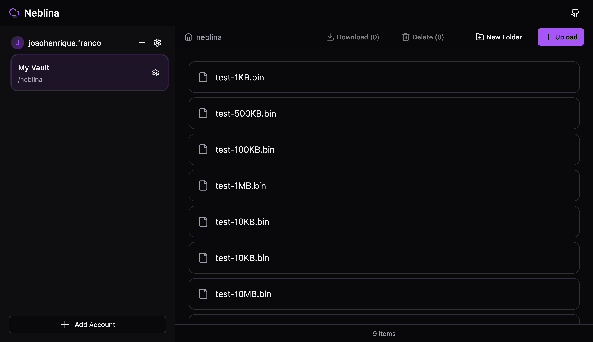
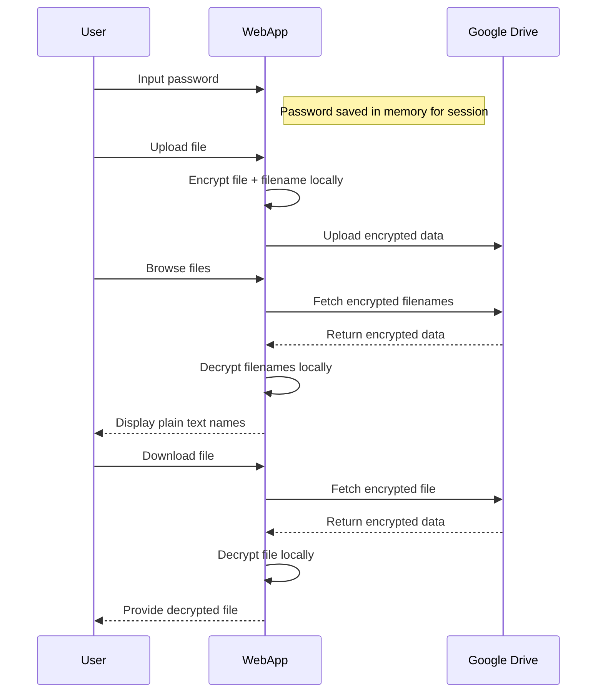

# Neblina

_Neblina_ is a client-side web application that adds transparent end-to-end encryption to cloud storage, ensuring your files remain private even from the provider.

Built on **[rclone](https://rclone.org/)'s proven crypt backend**, Neblina provides a web interface for existing rclone users or new users wanting encrypted cloud storage. Currently, only Google Drive is supported.

> 🏗️ Neblina is currently under active development. It has not undergone extensive security auditing. See [roadmap](#%EF%B8%8F-roadmap) for upcoming features.

## ✨ Features

- **Browser-based**: View and upload files just like in Google Drive - no installation required
- **Battle-tested encryption**: Uses rclone's original code compiled to WebAssembly - no reimplementation of encryption layer
- **Rclone compatibility**: Works seamlessly with existing rclone crypt remotes (some options are still in progress)
- **Zero-trust archtecture**: All operations execute in your browser, no requests to server after initial load - client-side everything
- **Secure OAuth**: Google Drive integration with short lived OAuth tokens

## 🚀 Quick Start

### Option 1: Use Public Instance

**Try Neblina at [neblina.cloud](https://neblina.cloud)**

No setup required! Uses our public Google Cloud app for OAuth authentication. Your encryption password and files never leave your browser.

### Option 2: Self-Hosting

## 📖 Usage

### For New Users

1. **Authenticate** with Google Drive using OAuth
2. **Create a Vault**: choose a strong password and a vault root folder within your cloud storage
4. **Start uploading** - files are automatically encrypted before reaching Google Drive

### For Existing rclone Users

1. **Find your password**: `rclone obscure --reveal your-obscured-password`
3. **Create a vault** with that password and the same location as your crypt remote

## 🔧 How It Works

## 🗺️ Roadmap

- [ ] Support for rclone's password2 (custom salt)
- [ ] Enable move operations
- [ ] Improve file grid UI
- [ ] Mobile responsive design
- [ ] Global vault search
- [ ] Password manager for vault configs
- [ ] Export/import rclone configs
- [ ] Enable using custom clients on neblina.cloud
- [ ] Disable local storage option
- [ ] Fire button

## 📚 Related Work

- [rclone Crypt Documentation](https://rclone.org/crypt/) - Underlying encryption implementation
- [WebAssembly Security](https://webassembly.org/docs/security/) - WASM security model
